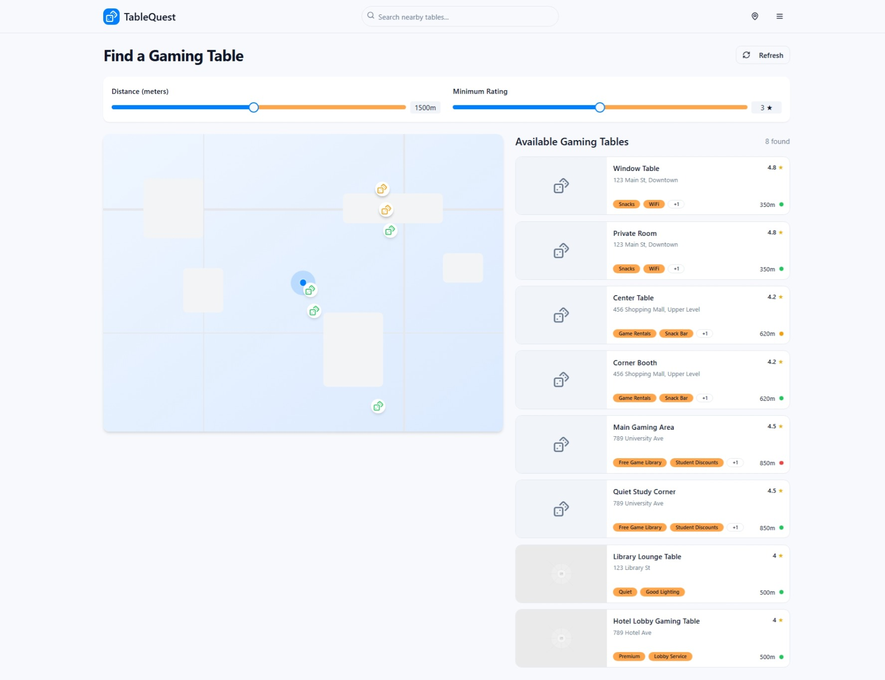

# TableQuest - Barcelona Gaming Table Finder

Find and book the perfect gaming table for your next board game night in Barcelona, Spain.

## Screenshots



## Project Info

- **Repository:** [GitHub link here]
- **Live URL:** [Deployment link here]

## Environment Variables

Create a `.env` file in the root directory with the following variables:

```sh
# MapBox token for maps and geocoding
VITE_MAPBOX_TOKEN=your_mapbox_token_here
```

To get a MapBox token:

1. Sign up at [mapbox.com](https://www.mapbox.com/signup)
2. Go to your account dashboard
3. Create a token with these scopes:
   - Styles:read
   - Fonts:read
   - Vision:read
   - Geocoding:read

### Barcelona Focus & Offline Mode

This app specializes in finding gaming tables throughout Barcelona, Spain. It includes:

- **Barcelona Neighborhoods**: Tables across L'Eixample, Gràcia, Barri Gòtic, La Barceloneta, and more
- **Location Detection**: Automatic neighborhood detection for all Barcelona coordinates
- **Local Context**: Barcelona-specific descriptions and cultural elements
- **Geographic Validation**: Address validation within Barcelona city limits

The app includes a fallback offline mode with mock data for Barcelona gaming tables:

- 8 gaming tables across Barcelona neighborhoods
- Focus on classic 4-6 player tables
- Realistic Barcelona addresses and coordinates
- Barcelona-specific amenities and descriptions (including Catalan snacks, local craft beers)
- Detailed venue information with ratings and reviews

If the MapBox token is invalid or connection issues occur, the app will automatically switch to a mock map with the Barcelona mock data.

## Features

- Browse and search for gaming tables in Barcelona
- Filter tables by player capacity (4-6 players) and Barcelona neighborhoods
- Barcelona-specific neighborhood filtering and detection
- View table amenities (Local Catalan snacks, WiFi, Air conditioning, etc.)
- Distance calculation from Barcelona city center (Plaça de Catalunya)
- User profiles and preferences
- Interactive MapBox map with Barcelona locations and neighborhood indicators
- Barcelona coordinate validation and automatic detection
- Offline mode with Barcelona-focused mock data
- Modern UI with shadcn-ui and Tailwind CSS
- Barcelona-optimized geocoding with neighborhood context

## Getting Started

### Prerequisites

- [Node.js](https://nodejs.org/) (v18+ recommended)
- [npm](https://www.npmjs.com/) or [bun](https://bun.sh/)

### Installation

```sh
git clone <YOUR_GIT_URL>
cd table-finder-app
npm install
```

### Development

Start the development server with hot reload:

```sh
npm run dev
```

### Build

To create a production build:

```sh
npm run build
```

### Lint

To check code quality:

```sh
npm run lint
```

## Project Structure

- `src/components/` – UI components (e.g., GamingTableListItem, GamingTableMap, Navbar)
- `src/pages/` – App pages (e.g., ProfilePage)
- `src/integrations/supabase/` – Supabase integration
- `src/services/` – Services including geocoding and Barcelona data helpers
- `src/lib/` – Utility libraries
- `public/` – Static assets

## Barcelona Neighborhoods

The app features gaming tables in these Barcelona neighborhoods:

| Neighborhood      | Description                                           |
|-------------------|-------------------------------------------------------|
| L'Eixample        | Central district with grid layout and many venues     |
| Barri Gòtic       | Historic medieval quarter with charming narrow streets |
| Gràcia            | Bohemian district with small plazas and local cafes   |
| La Barceloneta    | Beachside neighborhood with seafood and ocean views   |
| Sagrada Familia   | Area surrounding Gaudí's famous basilica              |

## Technologies Used

- [Vite](https://vitejs.dev/)
- [React](https://react.dev/)
- [TypeScript](https://www.typescriptlang.org/)
- [shadcn-ui](https://ui.shadcn.com/)
- [Tailwind CSS](https://tailwindcss.com/)
- [Supabase](https://supabase.com/) (for backend)

## Deployment

You can deploy this app using [Vercel](https://vercel.com/), [Netlify](https://www.netlify.com/), or any static hosting provider.
